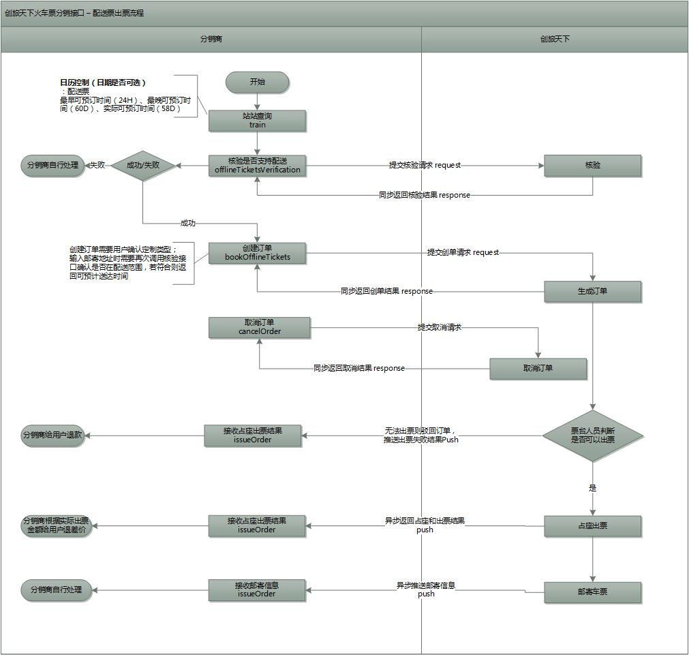

# 出票流程说明

## **电子票出票注意事项**

1、占座后是不直接出票，接口用户需要调用火车票出票接口完成扣款及出票动作； 

2、非直接出票模式下，占座成功后订单过期时间内未申请出票，订单视为过期，自动取消座位； 

3、若选择购买保险，则在出票成功后为用户投保，投保结果异步推送； 

4、支付类合作的分销商暂不支持走合并模式；

**5、测试期间请务必订15天以后发车的车次，且测试后需要申请退票，否则会产生真实费用；**

## 出票流程图

