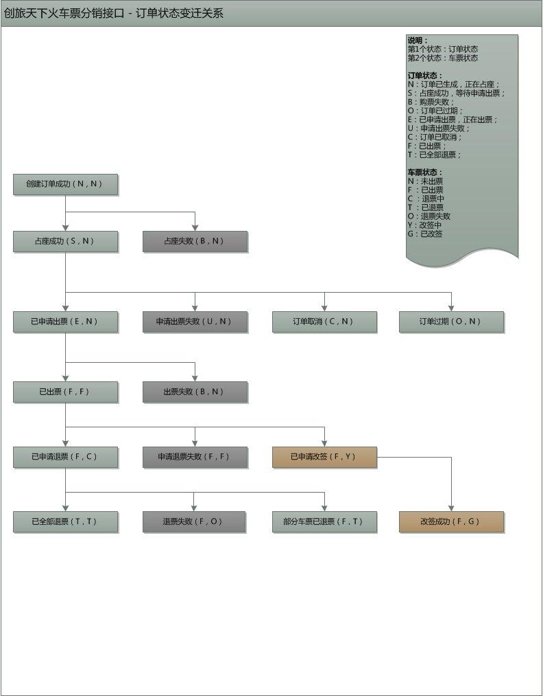

# 订单状态说明

## **订单状态说明**

| 订单状态 | 描述 |
| :--- | :--- |
| N | 订单已生成，正在占座 |
| S | 占座成功 |
| B | 购票失败 |
| E | 已申请出票，正在出票 |
| U | 申请出票失败 |
| C | 订单已取消 |
| F | 已出票 |
| T | 已全部退票 |
| O | 订单已过期 |

## **车票状态说明**

| 状态值 | 描述 |
| :--- | :--- |
| N | 未出票 |
| F | 已出票 |
| C | 退票中 |
| T | 已退票 |
| O | 退票失败 |
| Y | 改签中 |
| G | 已改签 |

##  订单状态变迁关系图

